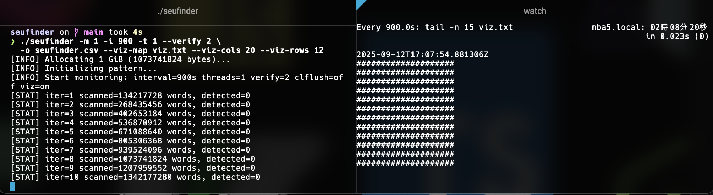

# SeuFinder

SeuFinder is a Rust tool for detecting and recording Single Event Upsets (SEU).

## Quick Start (Rust)

Rust 1.74 or newer is recommended. If `cargo` is available, no additional setup is required.

1. Build

   ```sh
   cargo build --release
   ```

2. Run

   ```sh
   ./target/release/seufinder-rs [options]
   ```

   Example: reserve 1 GiB and scan every 15 minutes

   ```sh
   ./target/release/seufinder-rs \
     -m 1 -i 900 -t 1 --verify 2 \
     -o seufinder.csv --viz-map viz.txt --viz-cols 20 --viz-rows 12
   ```



## Repository Layout

- `src/main.rs`: Rust implementation
- `Cargo.toml`: Rust project definition
- `Cargo.lock`: Locked dependency versions (generated)

## Key Options

- `-m <GiB>`: Memory size to occupy (GiB, e.g. `-m 1`)
- `-i <sec>`: Scan interval in seconds (e.g. `-i 900`)
- `-t <num>`: Number of worker threads (e.g. `-t 1`)
- `--verify <num>`: Re-read count per mismatch (e.g. `--verify 2`)
- `-o <file>`: CSV output path (e.g. `-o seufinder.csv`)
- `--viz-map <file>`: Append visualization grid to file (e.g. `--viz-map viz.txt`)
- `--viz-cols <num>`: Visualization grid columns (e.g. `--viz-cols 20`)
- `--viz-rows <num>`: Visualization grid rows (e.g. `--viz-rows 12`)
- `--clflush`: Enable cache flush before reads
- `--lock-pages`: Attempt to lock memory pages

## Features

- Write deterministic patterns and rescan at fixed intervals
- Detect DRAM bit flips (SEU) and log them to CSV
- Produce ASCII grids for quick visualization
- Designed for large memory footprints—ensure sufficient free RAM

## License

MIT
